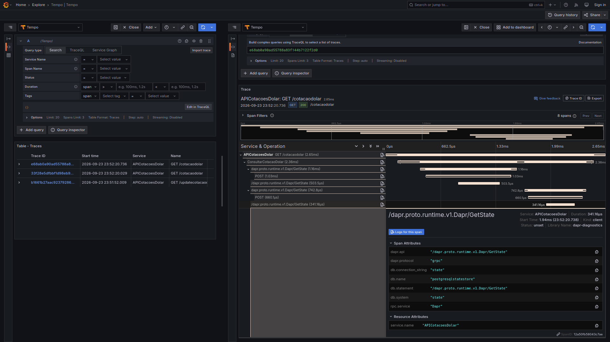
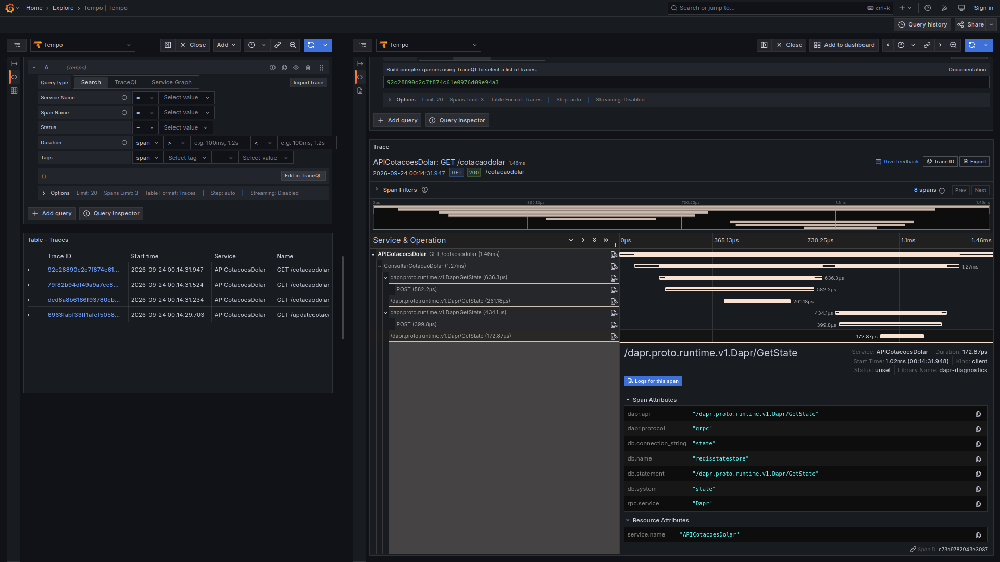

# aspnetcore10-dapr-statemanagement-otel-grafana_apicotacoesdolar
Exemplo de API REST criada com o .NET 10 + ASP.NET Core para simular cotações do dólar norte-americano utilizando building block de State Management do projeto Dapr. Inclui exemplos em YAML com Redis e PostgreSQL, monitoramento com OpenTelemetry + stack Grafana, além de um arquivo do Docker Compose para criação de ambiente de testes.

## Testes

Trace gerado ao utilizar o State Store baseado em PostgreSQL:

Trace gerado ao utilizar o State Store baseado em Redis:

